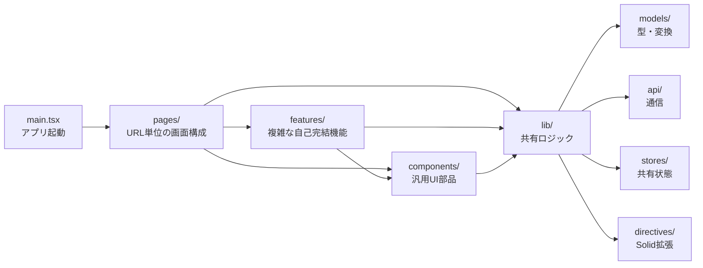

# Frontend プロジェクト構造

プロジェクト構成の整理軸にはTypeとFeatureがある。本プロジェクトでは基本的に、Type/Layer構成で整理するが、コンポーネントが肥大化した場合、必要に応じでFeaturesに切り出す。

**Type構成**
- 抽象度レイヤー（水平レイヤー）
- UI層・状態層・永続化層のような水平レイヤー
- 同種のコードを集約・正規化する

**Feature構成**
- 垂直スライス
- 1機能が全レイヤーを貫通するフォルダを持つ
- 機能というオブジェクトをフォルダに閉じ込める

**変更の同期性**
- 変更の同期性（volatility-based cohesion）が高いペアは、フォルダ階層でどちらの軸に乗せるかよりも、コメントで相互参照させる。

### なぜType/Layer構成を基本とするか

- JSXコンポーネント間の合成がフォルダ階層と無関係なimportグラフで表現され、かつ各コンポーネントが単一責務の変換関数として設計される、という2つの性質があるため、横断的に呼ばれる部品を機能（Feature）ではなく役割（Type）でラベル付けして集約するほうが、実際の依存関係の実態と整理の軸が一致する。

**物理的な近さと論理的な依存は一致しなくてよい**
- JSXではimport ConfirmDialog from "../../components/dialogs/ConfirmDialog"のように、フォルダを何階層も跨いでいても呼び出しコストは変わらない。だからこそ、「機能Aと機能Bが同じUIパターン（ダイアログ、メニュー）を呼び出す」という状況が起きたときに、そのパターンをfeatureフォルダの外に出して共有しても、JSXの合成という観点では何のペナルティもない。むしろ、この「物理配置と呼び出し関係の分離」こそJSXの強みなので、それを活かすなら「呼び出される頻度が高い部品ほど、特定のfeatureに帰属させず、中立的な場所（Type軸のcomponents/）に置く」のが自然な帰結になる。

**1コンポーネント＝1責務が徹底されているほど、Type軸での分類が機能する**
- JSXの関数コンポーネントは基本的に「入力（props）→出力（JSX）」という純粋な変換に近いモデルを志向する。この「小さく、単一責務」という性質が保たれている限り、それぞれのコンポーネントは「何をするものか」（Dialog系、Menu系、Layout系）で自然にラベル付けできる。逆にVueのSFCやAngularのようにテンプレート・スタイル・ロジックが1ファイルに強く同居するモデルでは、「このコンポーネントは結局どのドメインの一部か」という帰属意識のほうが強くなりやすく、Feature軸のほうが馴染みやすい。

### 考慮するべき前提
- このプロジェクトのバックエンドはNode.jsではなくGoであり、フロントエンドはSSGによりビルドされ、goバイナリにバンドルされる。
- 使用しているフレームワークはSold.jsであり、VueやSvelteやReactではない。Svelteコンポーネントではなく、jsxコンポーネントを使っている。
- Solid.jsは、JSXファイルを使ってUIを組み立てるのあり、第一に参考にするべきプロジェクト構成はReactと考えるのが妥当。

## pages - ルーティング先コンポーネント
- ページ／URLに対応する単位（1ページ=1画面）はpages/にFeature軸で縦割りする。ただし関連ロジックはlibに分散しているので、featuresではなくpagesと命名。
- 本プロジェクトではSolid.jsを使っているが、SolidStartのファイルベースルーティングではなくマニュアルベースのルーティングを使っているため、routesではなくpagesと命名。
- ページコンポーネントは、基本的に、featureやcomponentsを結びつけるだけ。

## components - 汎用UI部品
- 2箇所以上から呼ばれる、または「役割」で説明できるUI部品。Type軸で置く。

### 具体例
**AuthGate.tsx →  JSXを返す実コンポーネントなのでcomponents**
- こちらは`<Show when={authed()} fallback={<Login />}>`という条件分岐レンダリングを持つ、正真正銘の「コンポーネント」です。libに戻す理由はありません。判断基準を統一するなら、「JSXを実際にreturnして画面に何かを出す」ものはcomponents、「signal/hook/utilityだけを提供する」ものはlib、という区分けが一番シンプルで、AuthGateはこの基準で明確にcomponents側です。

## lib - components以外の共有ロジック
- 2箇所以上から呼ばれる、または「役割」で説明できる純粋関数。Type軸で置く。
- 共有componentや、feature、pageコンポーネントから利用される。
- libはデータフローの役割で分ける。型(models)→通信(api)→状態(stores)という一つのデータパイプラインをディレクトリ単位で表現する
- 性質がバラバラなものを「UIっぽいから」という理由だけで寄せ集めてはいけない。

### 1. models: 型定義とその変換ロジック
- MVC 由来で「データの形＋最小限の振る舞い」を指す語として業界的に共通認識があり、domainよりも SolidJS / PocketBase という薄い構成とスケール感が一致する。

### 2. api: サーバーとの通信窓口
### 3. stores: アプリ全体で共有される可変状態
### directives (例外): Solid固有の拡張メカニズム
- ripple.tsは、データを扱っているわけではなく、use:rippleというJSXテンプレート内で使うSolid特有の構文（declare module "solid-js"でJSX.Directivesを拡張している）のための場所。これは「データフローにおける役割」ではなく「Solidのある機能を使うために必要な実装」という別軸の基準で切られている。

### 具体例

**footerSlot.tsx / topBarSlot.tsx → JSXを返さない状態+フックのみなのでlib**
- この2つは`createSignal`でスロットの状態を持ち、`useFooterSlot`/`useTopBarActions`という登録用フックを export しているだけで、**自分自身は何も描画していません**（returnするJSXがない）。`.tsx`拡張子なのは型として`JSX.Element`を参照しているからに過ぎず、実態は`theme.ts`や`useTitle.ts`と同じ「横断的な状態管理モジュール」です。むしろこれをcomponentsに移すと、「componentsの中に何もレンダリングしないファイルが混ざる」ことになり、componentsディレクトリの一貫性（＝そこにあるものは開けば必ずJSXを返す）が崩れます。今のままlibに置くのが自然です。

**router.tsx → JSXを返すが再利用されない単一のアプリ配線。境界だがlib。**
- `AppRouter`はJSXを返す実質的なコンポーネントですが、他のcomponents配下のファイル（Sidebar, TopBar, ActionsMenuなど）と違って**再利用されることのない、アプリ全体で一度だけ使われるルート定義**です。`main.tsx`から直接importされる点も含めて、性質としては「アプリの配線・設定」に近く、`theme.ts`（importされた瞬間に副作用を持つ）と同じカテゴリだと考えられます。無理にcomponentsへ移動する必要性は薄いです。

## features - 自己完結した機能単位

- 単一の複雑な問題領域（パーサ、エディタなど）が内部結合を持ち、Type軸で割ると逆に理解しにくくなる場合は、型分類を無視して専用フォルダに固める。専用ドキュメントがあると好ましい。
- 自己完結度が高く、ドメイン知識の密度が高く、今後も肥大化が予想されるもの。
