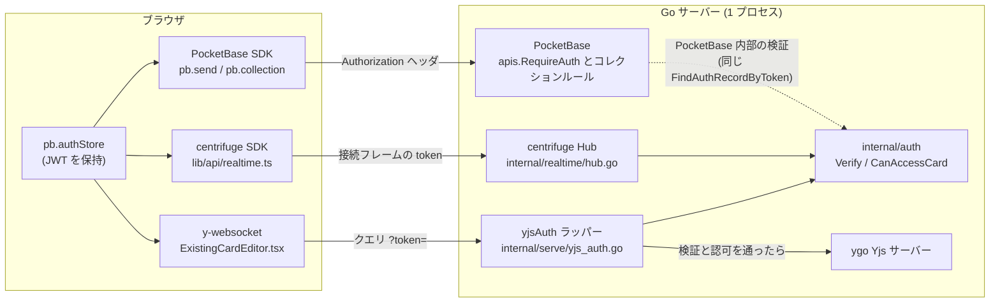
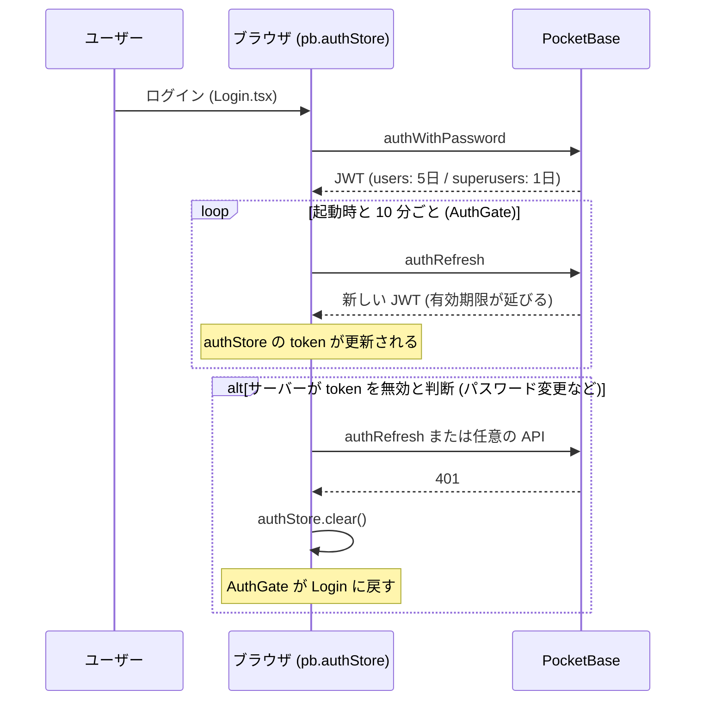
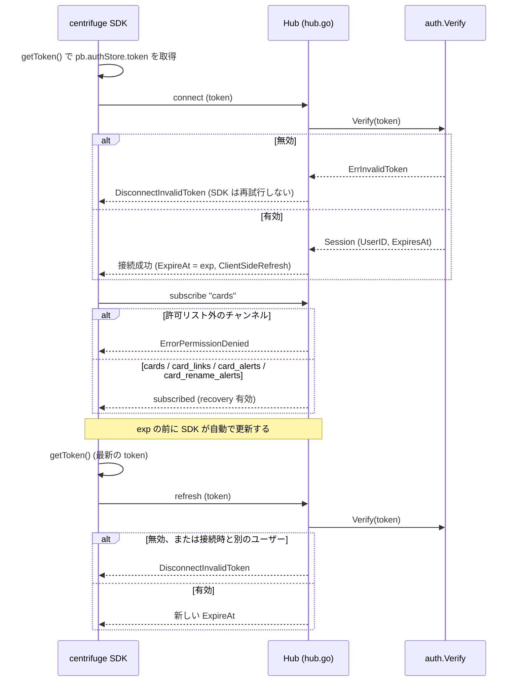
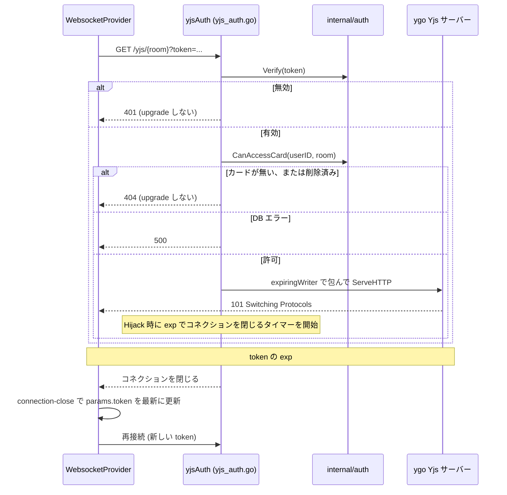
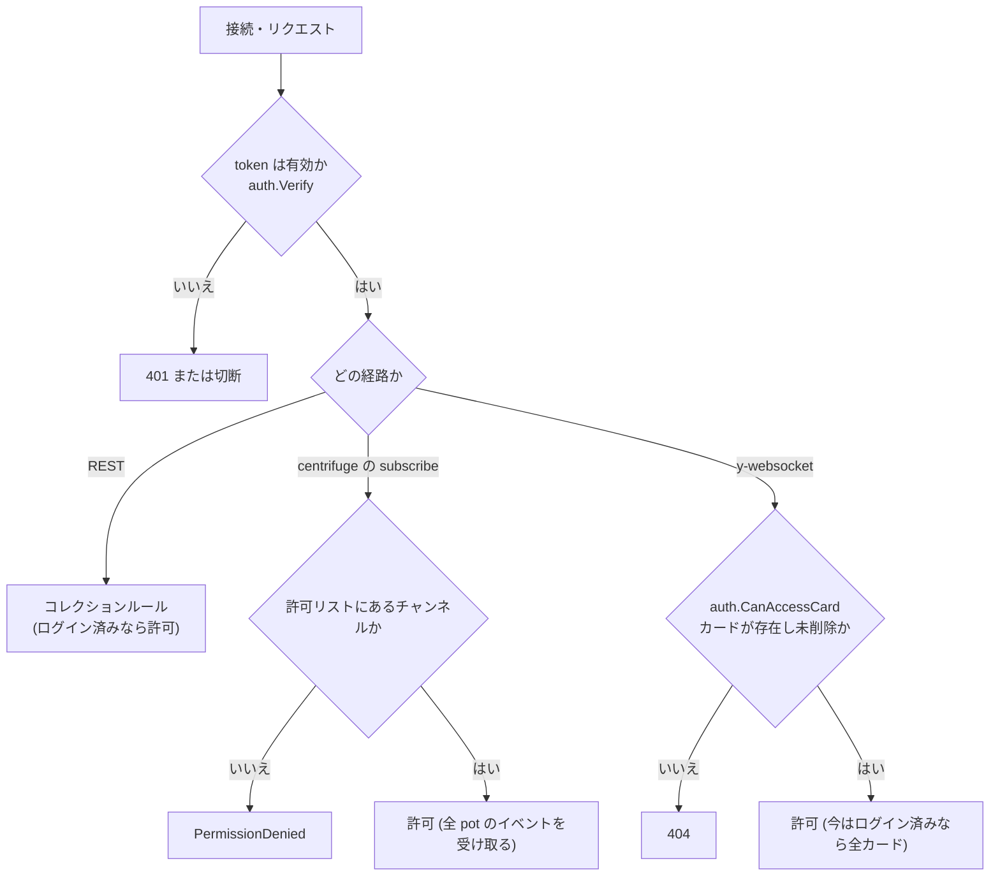

# 認証の仕組み（PocketBase / centrifuge / y-websocket）

PocketBase の REST API、centrifuge、y-websocket の 3 つの通信が、どう認証され、どのコードが何を守っているかをまとめる。

## 1. 要点

「認証の仕組みが 3 つある」のではなく、**資格情報と検証は 1 つで、運ぶ経路だけが 3 つ**ある。

| 層 | 内容 | 場所 |
| --- | --- | --- |
| 資格情報 | PocketBase が発行した auth JWT（クッキーは使わない） | ブラウザの `pb.authStore` |
| 検証 | token を検証して `Session`（userID と有効期限）を返す | `internal/auth.Verify`（1 か所） |
| 認可 | ユーザーがそのカードを開いてよいか | `internal/auth.CanAccessCard`（1 か所） |
| 運搬 | 経路ごとに token の載せ方が違う（§3） | 各トランスポート |

pot 単位の権限を入れるときは `CanAccessCard`（と将来の `CanAccessPot`）だけを変える。トランスポート側は変えない。

## 2. 全体像

- REST は PocketBase 自身が検証する。`internal/auth` は使わないが、内部では同じ `FindAuthRecordByToken` と同じ token を見ている。
- centrifuge と y-websocket は PocketBase の外の通信なので、`internal/auth` を通して同じ規則で検証する。

## 3. 経路ごとの違い

| | PocketBase REST | centrifuge | y-websocket |
| --- | --- | --- | --- |
| token の運び方 | `Authorization` ヘッダ（SDK が自動で付ける） | 接続フレーム（`getToken` が返す。URL に出ない） | URL のクエリ `?token=`（WebSocket はヘッダを付けられない） |
| 検証する場所 | `apis.RequireAuth()` / コレクションルール | `OnConnecting` | `/yjs/{room}` の `yjsAuth`（upgrade の前） |
| 認可 | ルール（`@request.auth.id != ""`） | チャンネル名の許可リストのみ | `CanAccessCard`（カードが存在し未削除） |
| 失効への対応 | リクエストごとに検証されるので不要 | `ExpireAt` と `OnRefresh` | `exp` で接続を閉じるタイマー |
| 失敗の見え方 | 401 → `pb.afterSend` が `authStore.clear()` | 切断コード（invalid token） | 401/404 だが、ブラウザには 1006 としか見えない |

## 4. token の寿命（共通）

- 2 本の WebSocket は、この `authStore` の token を読むだけで、発行も更新もしない。
- `pb.authStore.clear()` が呼ばれると `AuthGate` が全体をアンマウントするので、エディタの WebSocket も一緒に破棄される。

## 5. centrifuge

- `getToken` は `pb.authStore.isValid` が偽なら `UnauthorizedError` を投げ、SDK は再接続をやめる。
- クライアントが publish することはできない（`OnPublish` を設定していない）。
- チャンネルは `cards` などの全 pot 共通。pot ごとに絞る場合は、チャンネルを `cards:{potId}` のように分けて `OnSubscribe` で認可する変更が要る。

## 6. y-websocket

- 検証と認可は upgrade の**前**に終わるので、拒否された相手はソケットを持てない。
- `room` はカード ID。存在しない名前で room をメモリ上に作らせないために、`CanAccessCard` が存在確認を兼ねる。
- `expiringWriter` は ygo が `http.Hijacker` で接続を奪う瞬間にタイマーを仕掛ける。接続が先に閉じたらタイマーは止める（`expiringConn`）。

## 7. 認可の判断

## 8. 既知の制約

- **URL に token が載る**: y-websocket の token は URL に載るため、リバースプロキシや PocketBase のリクエストログに残りうる。クッキーを使わないので CSRF や CSWSH の心配はないが、このログ漏れは残る。対策はログ側のマスク、または寿命の短い room 限定 token（使い捨て JWT）の導入。その場合も入口は `yjsAuth` だけで済む。
- **張られた接続は失効しても exp まで生きる**: パスワード変更などで token が無効になっても、すでに張られた接続は `exp` まで通信できる（最大でユーザー 5 日、superuser 1 日）。即時に切りたい場合は、接続の登録簿を持って明示的に閉じる仕組みが別途要る。
- **pot 単位の権限はない**: 認可は「ログイン済みなら全許可」。入れる場所は `CanAccessCard` と、centrifuge のチャンネル分割。
- **y-websocket の認証失敗はブラウザから見えない**: 401/404 でも 1006 としか分からない。y-websocket は再接続し続けるので、ログイン切れは `AuthGate` が `authStore` の変化で検知する。カードが削除された場合は再接続が繰り返されるため、エディタ側の対処は別途必要。
- **再接続時の token 更新は y-websocket の実装に依存する**: `connection-close` で `provider.params.token` を書き換えており、v2 の `url` getter が `params` を読む前提。バージョンを上げるときは再確認する。

## 9. ファイル対応表

| ファイル | 役割 |
| --- | --- |
| `internal/auth/auth.go` | `Verify`（token → `Session`）、`CanAccessCard`（認可） |
| `internal/realtime/hub.go` | centrifuge の接続認証、`ExpireAt`、`OnRefresh`、チャンネル許可リスト |
| `internal/serve/yjs_auth.go` | `yjsAuth`（upgrade 前の検証・認可）、`expiringWriter`（exp での切断） |
| `internal/serve/handler.go` | `/yjs/{room}` に `yjsAuth` を挟む。`/api/admin` と `/api/pages` に `RequireAuth` を付ける |
| `frontend/src/lib/api/auth.ts` | ログイン、`refreshSession`、`authToken()` |
| `frontend/src/lib/api/pb.ts` | 401 で `authStore.clear()` |
| `frontend/src/lib/api/realtime.ts` | centrifuge の `getToken`、認証状態との連動 |
| `frontend/src/features/noteEditor/ExistingCardEditor.tsx` | y-websocket に `params.token` を渡し、再接続時に更新 |
| `frontend/src/components/AuthGate.tsx` | 10 分ごとの `refreshSession`、未認証時の Login 表示 |

## 10. 変更時のチェックリスト

- 検証規則を変える: `internal/auth.Verify` だけを変え、centrifuge と y-websocket の両方のテストが通ることを確認する。
- 認可を変える（pot 権限など）: `CanAccessCard` を変える。centrifuge も絞るならチャンネルの分割と `OnSubscribe` の変更を同時に行う。
- 新しい WebSocket を足す: token の運び方だけを決め、検証は `auth.Verify` を呼ぶ。独自の検証を書かない。
- token の運び方を変える（使い捨て token など）: 入口（`yjsAuth` や `OnConnecting`）だけを差し替える。`Session` の形は変えない。
