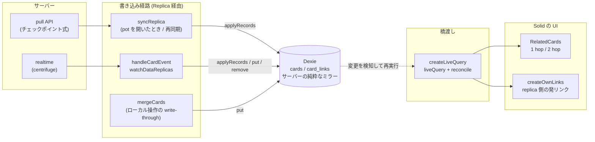
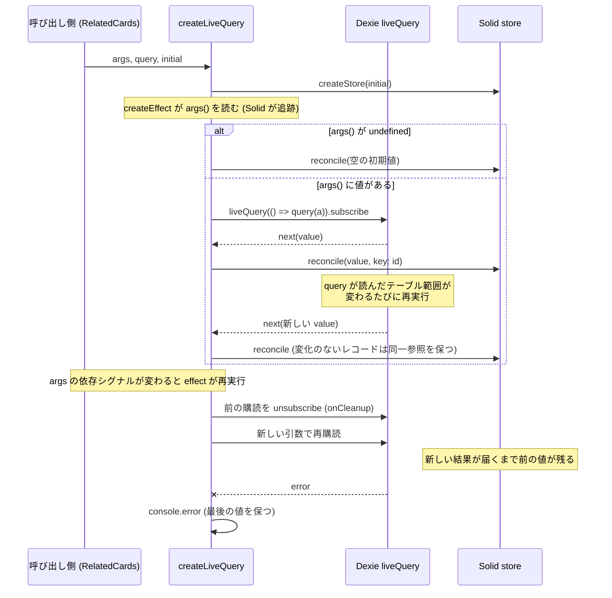
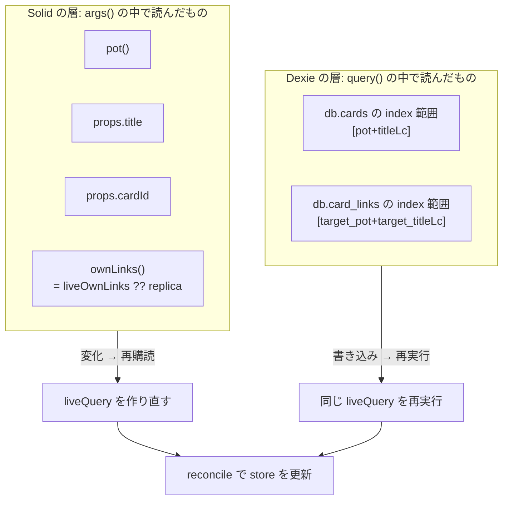
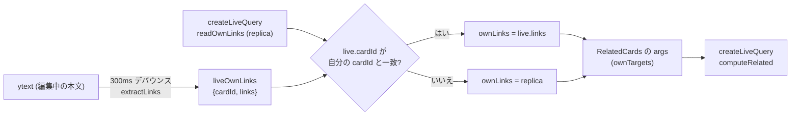
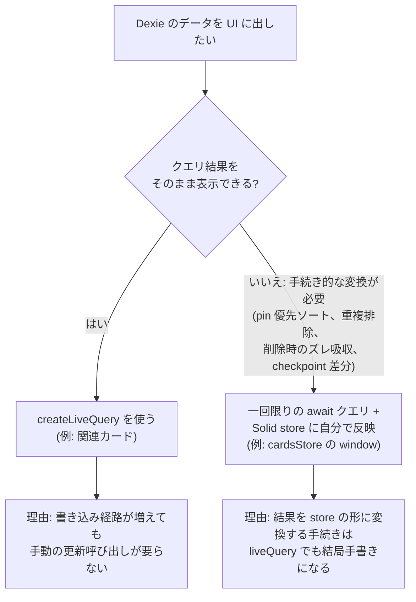

# Dexie liveQuery の使い方

このプロジェクトで Dexie の `liveQuery` を **どこで・なぜ・どのように** 使うかをまとめる。結論から言うと、`liveQuery` は **「クエリ結果をそのまま表示する」読み取り専用の導出** にだけ使い、橋渡しは `createLiveQuery`（`lib/dexie/liveQuery.ts`）1 か所に閉じ込めている。

## 1. 全体像

Dexie への書き込み経路はすべて `Replica`（`replica.ts`）に集約されている。`liveQuery` は Dexie のテーブルが変わると自動で再実行されるので、書き込み元（pull・realtime・ローカル操作）を呼び出し側が意識する必要がない。



ポイント:

- 実線が書き込み、点線が `liveQuery` による自動追随。
- Dexie の `cards` / `card_links` は **サーバーのミラー**。クライアントが導出した値は書き込まない（`link-extraction.md` §5）。
- 画面側は「どの経路で Dexie が変わったか」を知らない。だから `refreshLinkAlive()` のような手動の更新呼び出しを増やさずに済む。

## 2. `createLiveQuery` のライフサイクル

```ts
createLiveQuery(args, query, initial): Accessor<T>
```

| 引数 | 役割 |
| --- | --- |
| `args` | Solid のシグナルから入力を作る関数。**Solid が追跡する**。`undefined` を返すと「購読しない」 |
| `query` | `args` の値を受け取り、Dexie だけを読んで結果を返す非同期関数 |
| `initial` | 購読していない間・最初の結果が届くまでの値。`id` を持つ素のデータ |



挙動のまとめ:

- **再購読**: `args()` が読むシグナル（pot、title、cardId、ownLinks など）のどれかが変わると、前の購読を破棄して新しい引数で購読し直す。
- **値の更新**: `reconcile(value, { key: "id" })` で store を更新する。変化のないカードは同一オブジェクトのままなので、`<For>` が DOM を作り直さない。
- **エラー**: `console.error` に出すだけで、最後の値を保つ。次の変更で成功すれば回復する。
- **破棄**: コンポーネントが消えると `onCleanup` で購読解除する。

## 3. 何が再実行を引き起こすか（2 つの層）

再実行のきっかけは **Solid の層** と **Dexie の層** に分かれる。混同しやすいので区別して覚える。



- **Solid の層**: `args()` が返す入力を作るために読んだシグナル。変わると購読ごと作り直し。
- **Dexie の層**: `query()` の中で実際に触れた Dexie のテーブルと index 範囲。そこへの書き込みがあると、購読はそのままで `query()` だけ再実行される。
- `liveQuery` が追跡するのは **Dexie へのアクセスだけ**。`query()` の中で Solid のシグナルや他のストアを読んでも追跡されない。必要な値は `args` 経由で渡す。

## 4. 使っている場所

| 場所 | `query` | 追跡する Dexie の範囲 | 備考 |
| --- | --- | --- | --- |
| `RelatedCards` | `computeRelated`（`relatedQuery.ts`） | `cards` の `[pot+titleLc]`、`card_links` の `[target_pot+target_titleLc]` | 1 hop / 2 hop。`ownTargets` は `args` で渡す |
| `createOwnLinks`（`relatedStore.ts`） | `readOwnLinks`（`cardLinksCollection.ts`） | `card_links` の `source` | 開いたカードの発リンク（replica 側） |

### 発リンクの合成

開いているカードの発リンクは、保存を待たずに ytext から導出した値を優先する。



- 編集中は ytext が正本。replica 側が後から更新されても、所有カードのライブ値は上書きされない。
- ライブ値は `cardId` を持つので、直前に開いたカードの値が下書きや次のカードに見えることはない。

## 5. `liveQuery` を使う / 使わない判断

`cardsStore` の window（`cardsById` / `windows`）は **意図的に `liveQuery` を使っていない**（`cardsCollection.ts` 冒頭、`dexie-offline-sync.md` §7）。



- **使う**: 「導出して並べるだけ」で、結果がそのまま画面になるもの。
- **使わない**: ページング窓の管理のように、結果を手続き的に store へ畳み込むもの。`queryCardsPage` / `countCards` は一回限りの `await` クエリ。
- `linkAliveStore` の `refreshLinkAlive()` も現状は手動。`createLiveQuery` で実績ができてから別途移行する（判断 8）。

## 6. 書くときのルール

1. **`query` は Dexie だけを読む。** `liveQuery` は Dexie のアクセスしか追跡しない。それ以外の入力は `args` で渡す。
2. **`initial` は素のデータで、レコードは `id` を持つ。** `reconcile(..., { key: "id" })` が前提。`initial` の複製（`structuredClone`）を保持して、引数なしのときに戻す。
3. **Dexie にクライアント導出値を書かない。** `cards` / `card_links` はサーバーのミラーに保つ。
4. **規則の二重実装は共有フィクスチャで固定する。** 1 hop / 2 hop は Go の `links1Hop` / `links2Hop` が基準で、`testdata/link-graph.json` を TS（`relatedQuery.test.ts`）と Go（`link_graph_test.go`）が読む。
5. **タイトルの並びはコードポイント順**（`compareTitles`）。`localeCompare` や JS の `<`（UTF-16 順）は使わない。SQLite の `ORDER BY title` と揃えるため。
6. **`args` が `undefined` を返す間は何もしない。** pot やタイトルが未確定の間は購読しない。

## 7. 既知の制約

- ハブになるターゲット（何千枚ものカードがリンクする `#tag` など）では、2 hop の `bulkGet` が重くなり、関連テーブルが変わるたびに再実行される。現状は上限を設けない。重いと分かった時点で、件数上限と「もっと見る」、または再実行のデバウンスを検討する。
- 初回同期が終わっていない pot では、関連カードの行が足りないだけで誤表示は出ない。同期が進むと自動で埋まる。
- `args` が返すオブジェクトは依存が変わるたびに新しくなり、そのつど再購読になる。入力が頻繁に変わる箇所では `ownLinks` のデバウンス（300ms）が実質の歯止めになる。

## 8. テスト

- 実装は `fake-indexeddb` と `vitest` で検証する。`vitest.config.ts` で `resolve.conditions: ["browser"]` を指定し、Solid のブラウザビルドを使う（サーバービルドでは `createEffect` が何もしない）。
- `liveQuery.test.ts`: Dexie への書き込みで値が更新されること、`args` の変更で再購読されること、`undefined` で初期値に戻り問い合わせないこと、変化のないレコードの同一性、破棄後に問い合わせないこと、エラー時に最後の値が残ること。
- `relatedQuery.test.ts`: 共有フィクスチャによる 1 hop / 2 hop の契約。
- `relatedStore.test.ts`: `ownLinks` の優先関係（ライブ値が replica に上書きされないこと）。

## 9. ファイル対応表

| ファイル | 役割 |
| --- | --- |
| `frontend/src/lib/dexie/liveQuery.ts` | `createLiveQuery`（`liveQuery` を Solid に橋渡し） |
| `frontend/src/lib/dexie/relatedQuery.ts` | `computeRelated`（1 hop / 2 hop の導出） |
| `frontend/src/lib/dexie/cardLinksCollection.ts` | `readOwnLinks`（発リンクの replica 読み出し） |
| `frontend/src/lib/dexie/replica.ts` | `Replica`、`applyRecords`、`syncReplica`（書き込み側） |
| `frontend/src/lib/dexie/dataReplicas.ts` | `card_links` の同期と realtime 反映 |
| `frontend/src/lib/stores/relatedStore.ts` | `createOwnLinks`、`liveOwnLinks` |
| `frontend/src/pages/cards/RelatedCards.tsx` | `createLiveQuery` の利用側 |
| `frontend/src/lib/models/compareTitles.ts` | コードポイント順の比較 |
| `testdata/link-graph.json` | 1 hop / 2 hop の TS と Go の契約 |
