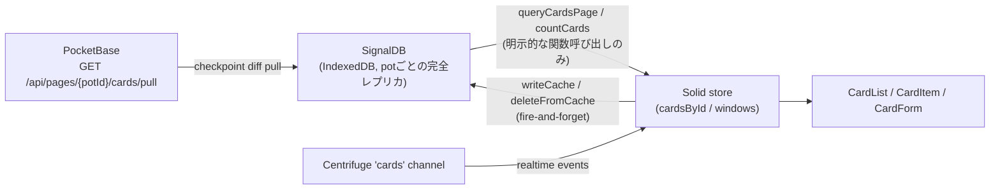

# カード一覧のオフライン同期 / ページング設計

カード一覧（1ポット最大10万件、CLAUDE.md参照）を、無限スクロールのUXを保ったまま、Centrifugeの履歴切れ時にも全量再フェッチせず復旧できるようにする設計。

最終形は「SignalDBをpotの**完全なローカルレプリカ**にし、サーバーとはcheckpointベースの差分だけをやり取りする」というもの。段階的に実装した経緯はgit historyに残っているが、このドキュメントは経緯を追う日誌ではなく、**現在の設計を正しく理解し、変更時に壊しやすい前提を再確認するためのリファレンス**として書く。

## 1. 全体像

- **SignalDB**（`frontend/src/lib/signaldb/cardsCollection.ts`）: potごとにIndexedDBへ永続化された、そのpotの全カードのローカルコピー。**UIから直接reactiveにバインドされることはなく**、`queryCardsPage`/`countCards`という明示的な関数呼び出しでのみ読まれる「ページング用のローカルインデックス」という位置づけ。
- **Solid store**（`frontend/src/lib/stores/cardsStore.ts`）: `cardsById`（idごとのカード実体）と`windows`（potごとに「今表示している範囲」を持つ`PotWindow`）。UIが実際に読む唯一のソース。SignalDBとは`mergeCards`/`dropCard`などの更新関数の中で常に両方に書き込むことで同期させている（reactive queryでの自動伝播ではなく、明示的な二重書き込み）。

## 2. サーバー側プロトコル

`internal/serve/replication.go`が`GET /api/pages/{potId}/cards/pull`を提供する。

- クエリパラメータ: `updatedAt`+`id`（checkpoint、両方セットか両方省略かのどちらか）、`limit`（省略時`defaultPullLimit=200`、最大`maxPullLimit=1000`）。
- `(updated, id)`昇順で、checkpointより後に変更されたカードを返す。**ソフトデリートされたカードも除外せず含める**（`deleted`日付がセットされた状態で返る）。呼び出し側はこれを削除イベントとして扱う。
- 終了条件はシンプル：返却件数が`limit`未満なら「これが最後のページ」。

## 3. クライアント側の3層

### 3.1 `lib/api/replication.ts` — pullクライアント

- `pullAll(potId, after)`: checkpointをループしてpullし切り、`{records, checkpoint}`を返す。`checkpoint`は最後に処理したレコードの`(updated, id)`、何も取得できなければ`after`をそのまま返す。
- `PULL_LIMIT = 1000`はサーバーの`maxPullLimit`と一致させている（一致していないと、ページがちょうど`PULL_LIMIT`件のとき「まだ続きがある」と誤判定/誤終了する）。

### 3.2 `lib/signaldb/cardsCollection.ts` — ローカルレプリカ

- カード本体: pot単位のコレクション、名前は`cards-cache-${potId}`。旧SyncManagerベース実装が使っていた名前（`cards-<pot>`, `cards-sync-v2-...`）とは意図的に別名にしてあり、ブラウザに残る古いIndexedDBデータを引き継がない。
- checkpoint: `cards-cache-checkpoints`という別コレクションに、pot単位で1レコード保存する。カード本体とは別の関心事のため分離している。
- `queryCardsPage(potId, skip, limit)` / `countCards(potId)`: ソートは`{ pin: -1, position: -1, id: 1 }`固定。**このソート定義はこのファイルだけにある**（サーバー側のREST一覧取得は廃止済みなので、二重管理の心配はない）。
- **`writeCache`/`deleteFromCache`は必ず`collection.isReady()`を`await`してから書き込む。** 生成直後のコレクションはIndexedDBからのハイドレーションが終わっておらず、それより前の書き込みはハイドレーション完了時に無条件で上書きされて消える。例：カードをURLから直接開いて`queryCardsPage`/`countCards`を一度も呼ばずに削除すると、この`await`がなければ削除がIndexedDBに反映されず、次回そのpotを開いたときにカードが復活する。

### 3.3 `lib/stores/cardsStore.ts` — UIが読む唯一のソース

- `PAGE_SIZE = 100`: 無限スクロールでDOMに描画する件数を抑えるための定数。REST時代の名残ではなく、SignalDBへのローカルクエリでも同じ理由で必要（potが10万件のとき、一度に全件を`ids`へ入れると無限スクロールが無意味になり、DOM件数が跳ね上がる）。
- `windows[potId].ids`は「読み込んだ範囲」であり、表示順そのものではない（表示側で都度ソートする。`CardList.tsx`のpin優先ソート参照）。
- `mergeCards`: SolidストアとSignalDBキャッシュの両方に書き込む唯一の入口。`skipFlip`はdnd-kitが自前でアニメーションさせる自分自身のドラッグ操作の場合に使う（FLIPアニメーションと二重に動いてカクつくのを防ぐ）。

## 4. 主要フロー

### 4.1 初回オープン（`loadNextCardsPage`）

1. `windows[potId]`が無ければ`{ids: [], total: 0, loaded: false, loading: true}`を作り、`ensurePotSynced(potId)`を`await`する。
2. `ensurePotSynced`は`potSyncPromises: Map<string, Promise<void>>`でpot単位に同期Promiseをキャッシュする。`loadNextCardsPage`の初回呼び出しと`IntersectionObserver`の初回発火など、短時間に複数回呼ばれても`pullAll`は一度しか発行されない。
3. 実体は`syncPotReplica` → `pullAndApplyDiff`：保存済みcheckpointから`pullAll`し、`applyPulledRecords`でSignalDBに反映（`deleted`が立っていれば`deleteFromCache`、それ以外は`writeCache`でupsert）、成功したcheckpointを`writeCheckpoint`で保存。失敗してもログのみで握りつぶし、SignalDBの中身（前回同期時点のもの）はそのまま使われる。
4. 同期完了後、初めて`queryCardsPage`/`countCards`でページを読み、`windows`と`cardsById`に反映する。

**重要**: 「まず古いIndexedDBキャッシュを一瞬見せてから上書きする」という二段階ペイントは行わない。同期完了を待ってから初めて描画する。オフライン時は同期が失敗して前回同期時点のデータがそのまま表示される（stale-but-consistent）。

### 4.2 ページ送り（スクロール）

- `loadNextCardsPage`は「次のページ」ではなく「windowの終端を含むページ」を要求する（`queryCardsPage(potId, win.ids.length, PAGE_SIZE)`）。
- 理由：window内のカードが削除されると、ローカルキャッシュの並び順は1件分前に詰まる。単純に「最後に読んだページ番号+1」を要求すると、詰まった分だけ1件スキップしてしまう。終端の`skip`値を毎回`win.ids.length`から再計算することで、このズレを避けている。
- 重複したidは無視して追加するだけなので、この方式による多少の重複読み込みは無害。
- 追加0件のページが返ってきたら、キャッシュの並びとwindowがズレたと判断してwindowを「完了」扱いにする（無限ループ防止。リロードで直る）。

### 4.3 リアルタイム反映（Centrifuge）

- `AppShell`が起動時に一度だけ`watchCards()`を呼び、`cards`チャンネルを購読する（potごとではなく全pot共通の1チャンネル）。
- `handleCardEvent`: `delete`または`deleted`付きの`update`は`dropCard`、`create`は`addCreatedCard`（**windowがロード済みのpotのみ**反映。未ロードのpotは次のページロードで自然に入ってくる）、それ以外の`update`は**すでにストアが保持しているカードにのみ**適用する（保持していないカードのupdateは無視。ストアが際限なく膨らむのを防ぐ）。
- `withCardsFlip`でラップされており、他ユーザーのドラッグによる並び替えもFLIPアニメーションで滑らかに反映される。

### 4.4 履歴切れからの復旧（`resyncPot`）

Centrifugeの購読が「履歴切れ」（サーバー再起動、履歴の保持期限切れ、履歴オーバーフロー）を検知すると`onResync`が発火し、現在ロード済みの全potについて`resyncPot`が呼ばれる。

1. `win.ids.length`（windowSize）を記録。
2. `pullAndApplyDiff(potId)`（4.1と同じ関数）で、保存済みcheckpointからの差分をSignalDBに反映する。**REST APIへの再フェッチは一切発生しない** — これがこの設計の核心であり、当初の課題（履歴切れのたびに全量再フェッチ）を解消している。
3. `queryCardsPage(potId, 0, windowSize)`で、windowが元々カバーしていた件数を**1回のローカルクエリ**として読み直す。SignalDBがpotの全カードを保持する完全レプリカだからこそ、ページごとに何度も問い合わせる必要がない（window方式ではサーバーの`updated`差分だけから「今の上位N件」を再構成できなかったが、全件ローカル複製なら並び替えをクライアント側で毎回計算し直せる）。
4. 再読み込みした結果に含まれないid（`vanished`）は`cardsById`から削除する。**ただし`deleteFromCache`は呼ばない** — 永続キャッシュ(SignalDB)からの削除は`applyPulledRecords`が「本当に削除されたカード」だけを対象に行うので、単に並び替えでwindow外に出ただけのカードを誤って永続キャッシュから消さないようにするため。

## 5. 既存インターフェースとの互換性

`potWindow` / `cardsById` / `loadNextCardsPage` / `resyncPot`の外部シグネチャは、REST paging時代から一切変えていない。`CardItem`/`CardList`/`CardForm`など呼び出し側のコードは無変更で済んでいる。変更は`cardsStore.ts`とその依存先（`lib/signaldb/*`, `lib/api/replication.ts`）に閉じている。

## 6. 既知の制約

- **初回同期（checkpoint未保有）は必ずフル取得になる。** 差分の起点が存在しない以上避けられない。「2回目以降」から差分同期の恩恵を受ける。
- 1ポット最大10万件を前提とすると、SignalDBが全件をIndexedDBに保持するため、初回同期のコストとストレージ使用量はそれなりに大きい。シンプルさとのトレードオフとして許容している。
- `queryCardsPage`のソート定義（`{ pin: -1, position: -1, id: 1 }`）は`cardsCollection.ts`にしかないが、CardListの表示順ロジック（pin優先の並び替え）と意味的に対応している必要がある。どちらかを変える場合はもう一方も確認すること。

## 7. テストの構造（`cardsStore.test.ts`）

- `nextLocalPage(items, total)`: `queryCardsPage`/`countCards`が次に返す値をキューする。`loadNextCardsPage`と`resyncPot`のwindow再読み込み、両方で使う。
- `nextDiff(records)`: `pullAll`が次に返す`{records, checkpoint: null}`をキューする。`ensurePotSynced`（初回同期）と`resyncPot`（差分適用）、両方の経路で消費される。
- `../api/realtime`と`../signaldb/cardsCollection`はモジュールごと`vi.mock`している。前者はCentrifugeへの実接続が必要なため、後者はjsdomにIndexedDB実装が無いため。
- `beforeEach`で毎回`releasePot`を全potId分呼び、`queryCardsPage`/`countCards`/`pullAll`のモックをリセットする。`resync()`のテストがロード済みの全potを対象にするため、前のテストのpotが残っていると意図しないページを消費してしまう。
